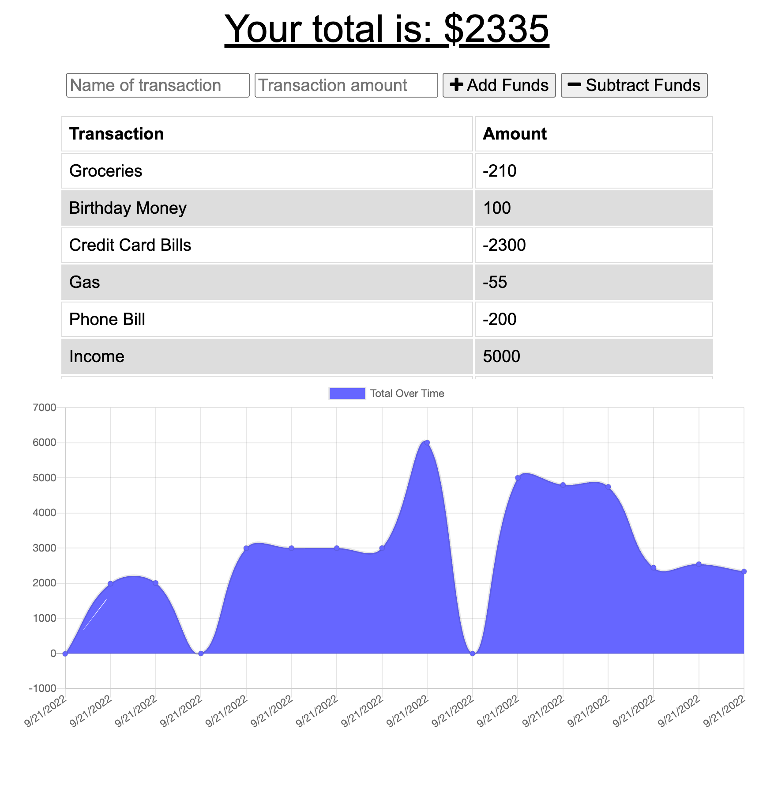

# Budget Tracker

## Description
Budget Tracker was created as an easy way to budget money. The user can either add or deduct money from their budget.

## Installation
To install the application, clone or fork the repository. Type `npm install` into your terminal to install the required dependencies.

## Screenshots

## Links
- [Github Repository](https://github.com/hlnicks/budget-tracker)
- [Heroku](https://secure-tor-47626.herokuapp.com/)

## Credits
- [Orginal Repo](https://github.com/coding-boot-camp/symmetrical-bassoon)